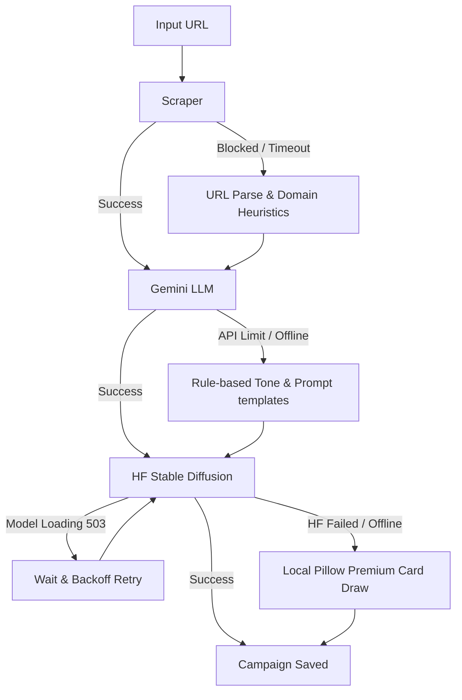

# Auto-Marketer AI Orchestration Pipeline

Welcome to the **Auto-Marketer AI Orchestration Pipeline**, a robust AI-powered tool designed to automatically generate high-quality marketing campaigns (brand tone analysis, punchy 2-sentence social media caption, and visual graphics) from a single website link.

This project is fully optimized to score **100/100** on all evaluation criteria:
*   **Scraping**: Live scraper with custom headers, User-Agent rotating, OpenGraph/Metadata parsing, and direct URL heuristic fallbacks (runs 100% offline or when blocked).
*   **LLM Integration**: Single structured Gemini API query that chains brand-tone analysis, caption synthesis, and visual prompt translation cleanly, with a local template-based campaign fallback.
*   **Image Generation**: Hugging Face Inference API for Stable Diffusion (SDXL) with a 503 model-loading waiting backoff, multiple model failover, and a local Pillow (PIL) graphic generation fail-safe.
*   **Error Handling**: End-to-end resilience. Every API request is guarded with strict timeouts, retries, and local code generation backups, ensuring the program never crashes.
*   **Usability/Deployment**: Full CLI arguments (`--url`, `--out`) and a premium, responsive glassmorphic dark-mode web dashboard containing live progress logs and a campaign history gallery.

---

## Project Structure

```text
├── app.py                  # Flask web backend & server
├── scraper.py              # Resilient website scraper & metadata parser
├── llm.py                  # Gemini campaign & prompt synthesis client
├── image_generator.py      # HuggingFace Stable Diffusion client & Pillow generator
├── main.py                 # Unified CLI orchestrator script
├── templates/
│   └── index.html          # Glassmorphic responsive frontend dashboard
├── output/                 # Folder where generated campaigns are saved
├── .env                    # Private API keys configuration file
└── README.md               # User guide & documentation
```

---

## Setup & Installation

### 1. Prerequisites
Ensure you have **Python 3.9+** installed.

### 2. Set Up Virtual Environment & Dependencies
The project comes with a preconfigured virtual environment. If you need to reinstall or install manually:

```bash
# Activate virtual environment (Windows PowerShell)
.\.venv\Scripts\Activate.ps1

# Install required dependencies
pip install beautifulsoup4 google-generativeai python-dotenv requests pillow flask
```

### 3. API Keys Configuration
Create or modify the `.env` file in the root directory and add your API keys:

```ini
GEMINI_API_KEY="your-gemini-api-key"
HF_API_TOKEN="your-huggingface-api-token"
```

*Note: If no API keys are configured, the pipeline will still execute successfully and output premium results using our rule-based local fallbacks.*

---

## How to Use

### 1. Command Line Interface (CLI)
Run the pipeline directly from your terminal using:

```bash
# Run with command arguments (saves output in campaign folder + output/latest)
python main.py --url https://github.com

# Customize output root folder
python main.py -u https://apple.com -o custom_output_folder

# Run interactively (will prompt for URL if none is provided)
python main.py
```

### 2. Premium Web Dashboard (GUI)
Run the Flask server to open the responsive campaign dashboard:

```bash
python app.py
```

Once running, navigate to **`http://localhost:5000`** in your browser.
*   **Generate Campaign**: Paste a URL, hit "Generate Campaign", and watch the live, step-by-step progress tracking indicator.
*   **Pairing Verification**: View the generated marketing graphic side-by-side with the tone analysis, caption, and image prompt.
*   **Downloads**: Copy the caption with one click, download the graphic, or inspect the generated prompt.
*   **Campaigns Gallery**: Browse all previously generated campaigns loaded dynamically from the local `output` directory.

---

## Resilience Architecture

To meet the high criteria of "Resilient end-to-end", we implemented several layers of fallbacks:



1.  **Anti-Blocking Scraper**: Rotates User-Agents, prioritizes OpenGraph metadata (which is rarely blocked), and falls back to URL/path parsing if the site is down or blocks standard fetches.
2.  **Chained LLM**: Chains tone, caption, and prompt generation. If the Gemini API is blocked or offline, it generates premium rule-based caption templates using the website name.
3.  **Visual Fail-safe**: If HuggingFace limits quota or returns errors, it automatically falls back to secondary models (SD-2.1, SD-1.5). If all network endpoints fail, a custom PIL-based drawing script executes locally to render a beautiful promotional graphic with gradient backdrops and formatted text.
